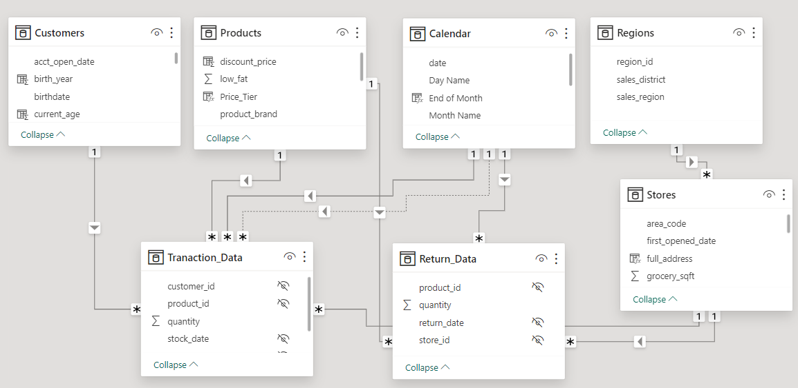

# Analyzing Maven Market Data with Power BI

## Introduction

This project is a part of assignment to the Microsoft Power BI Desktop for Business Intelligence (2023) course offered by Udemy on behalf of Maven Analytics. 

## Project Overview

Maven Market, a hypothetical multi-national grocery chain with locations in Canada, Mexico and the United States sought insights for their business by hiring a business intelligence analyst

(A) The management of Maven Market has intimated their expected dashboard contents for the year 1998 only. Those are:-

1. Help the management team track their **KPIs, things like sales, revenue, profit and returns**,
	
2. Compare **performance across regions**, 

3. Analyze **weekly transaction trends**, and

4. Track status of revenue target - 5% lift over the previous month revenue

(B) This project followed some key steps, each contributing to a comprehensive analysis of the data:

1.  **Connecting and Shaping the data (ETL):**  The Comma Separated Value (CSV) files of the business were downloaded in local system and subsequently each file was checked for data inconsistency & missing values and accordingly during transformation phase, the data is made consistent to maintain data hygiene.

2.  **Building a relational model:**  After obtaining the cleaned data, tables were connected based on their unique relationship with each other

3. **Adding calculated fields:** Created various explicit Data Analysis Expressions (DAX) measures to address business matrix required to analyse the data, and

4. **Designing an interactive report:** Designed an interactive dashboard to address business questions with data backed solutions and data driven decision making.

 
## In Power Query Editor

The following ETL steps were undertaken to clean & transform the raw data into a meaningful and suitable data which is essential for business analysis:-

1. **Extracted CSV file into power query editor**
2. **Replace "null" values with zeros**
2. **creating Calculated & Conditional column**
3. **Use of Group By option**
4. **Extracting the characters from field to a new coloumn**
5. **Connect to the folder path for data or fact table**

   
## In Model View

1. **All relationships followed one-to-many cardinality, with primary keys on the lookup (Dimension) side and foreign keys on the data (Fact) side**
2. **Followed star & snowflake schema**
3. **Filter context flows "downstream" from lookup tables to data tables**
4. **Data tables are connected via shared lookup tables (not directly to each other)**
5. **all foreign keys were made invisible** 

## In Data View
**Data Categorization for financial & geographic visuals** and
**Calculated Columns** 

## Explicit DAX Measures 

Some of the DAX measure which are used in the dashboard for visualization of key business intelligence matrix are:-

1. **Quantity Sold:** calculate the sum of quantity from Transaction table

2. **Quantity Returned:** calculate the sum of quantity from Return table

3. **Total Transactions:** Counts number of rows from Transaction table.

4. **Total Returns:** Counts number of rows from Return table.

5. **Return Rate:** Counts number of rows from Transaction table.

6. **All Transactions:** calculate grand total transactions, regardless of filter context.(used **ALL** function)

7. **All Returns:** calculate grand total returns, regardless of filter context. .(used **ALL** function)

8. **Total Revenue & Total Cost:** calculate using ALL iterator function and RELATED lookup function

9. **Total Profit:** total revenue minus total cost

10. **Profit Margin:* by dividing total profit by total revenue

11. **YTD Revenue:** calculate year-to-date total revenue using DATESYTD function

12. **Last Month Transactions, Last Month Revenue, Last Month Profit, and Last Month Returns:** create measure using CALCULATE and DATEADD function

13. **Revenue Target**  5% lift over the previous month revenue
    

## Creating Dashboard for Visualisation (even for mobile)

Data visualisation need utmost attention as the data can able to communicate to the audience only when presented in simple and meaningful way. For instance, consideration to accessibility ethics is ensured by the use of gradient colour pallets. Other visuals are:-

1.**Data bar:** use of conditional formatting

2.   Use of **Column Chart, Tree Map & Gauge Chart**	

3. Use of **TopN & Basic filter** at report and visual level

## Insights

1. **Top performing band in sales** - Hermanos

2.**Top profit giving brand**-Plato with 64.07% profit margin

3.**The brand facing highest return of products-** PigTail with 1.71%

4.**The store in Hidalgo city, Mexico has recorded highest number of sales (16,614). It has sold products of Ebony brand for 730 times**

5.**The store in Portland, USA clocked 1000 Sales in December**

## Repository Purpose
**There are measures in this project which are yet to be used for product and store page.**
---
